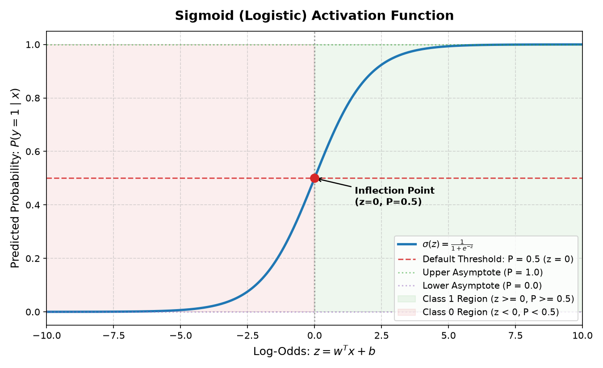
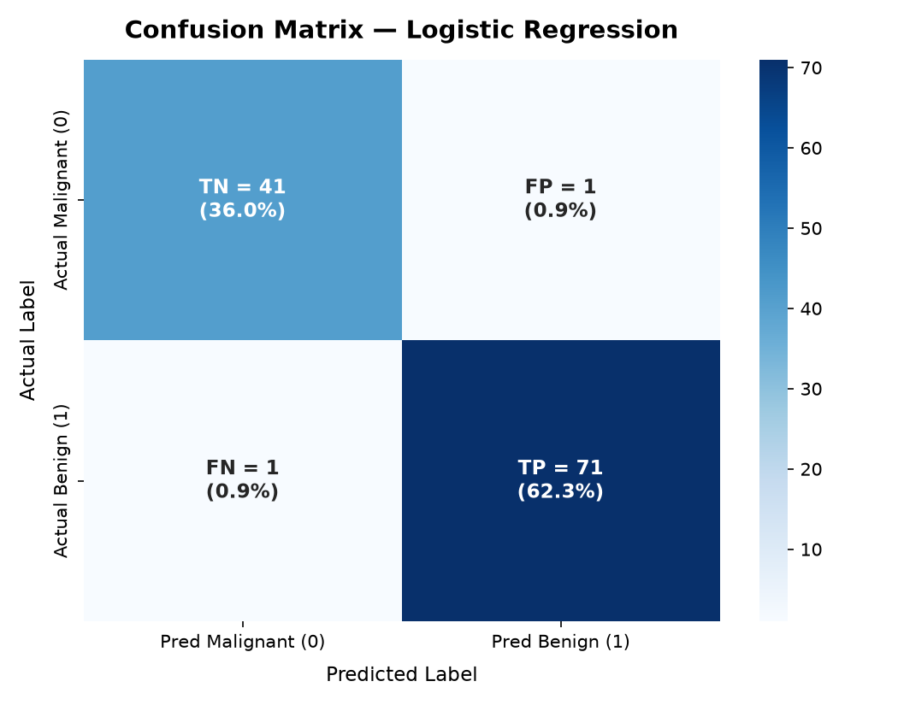
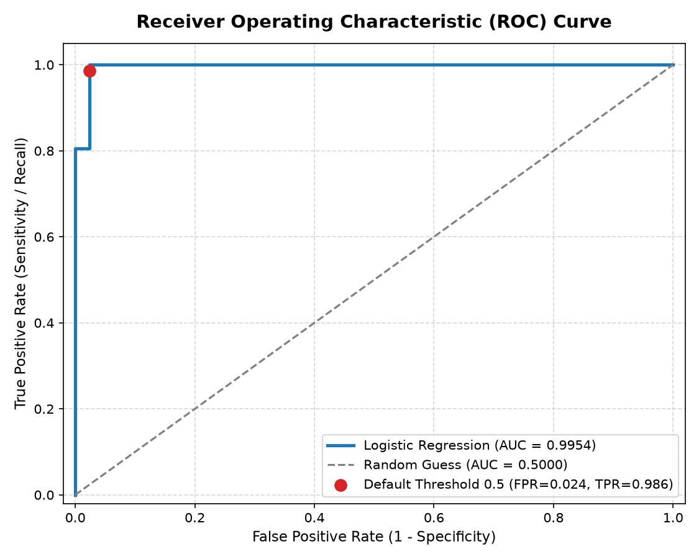
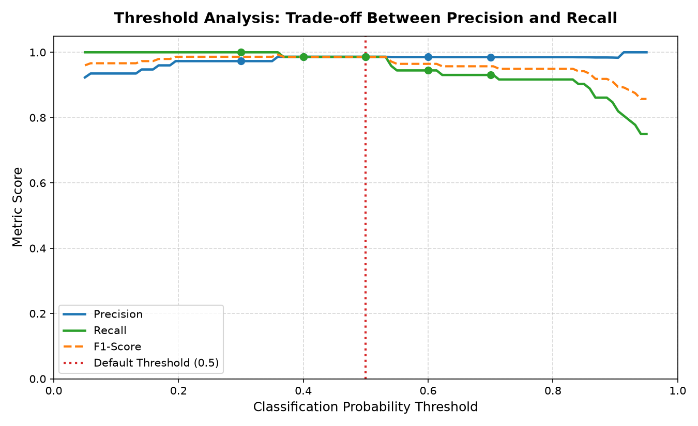

# Logistic Regression Classification

## Overview

This project implements a binary classification pipeline using **Logistic Regression** on the **Breast Cancer Wisconsin Diagnostic Dataset**. Built as part of the AI & ML Internship (Task 4), this project demonstrates core concepts in supervised machine learning, statistical classification, data leakage prevention, probability modeling with the sigmoid activation function, comprehensive evaluation metrics, decision threshold tuning, and strategies for handling class imbalance.

---

## Objective

- Build an end-to-end binary classifier using Logistic Regression in Python.
- Preprocess and standardize clinical features while strictly avoiding data leakage.
- Mathematically explain and visualize the Sigmoid activation function.
- Evaluate the model using rigorous classification metrics: Accuracy, Precision, Recall, F1-Score, and ROC-AUC.
- Dissect the Confusion Matrix (True Positive, True Negative, False Positive, False Negative).
- Experiment with and analyze classification probability thresholds (0.3 to 0.7) and trade-offs.
- Analyze class distribution and assess mitigation strategies for class imbalance.

---

## Dataset

- **Dataset Name:** Breast Cancer Wisconsin (Diagnostic) Dataset
- **Source:** Loaded directly via `sklearn.datasets.load_breast_cancer()`
- **Number of Samples:** 569 patient biopsy samples
- **Number of Features:** 30 continuous numerical features computed from digitized fine needle aspirate (FNA) images of breast masses (e.g., radius, texture, perimeter, area, smoothness, compactness, concavity, concave points, symmetry, and fractal dimension across mean, error, and worst values).
- **Target Variable:**
  - `0`: **Malignant** (harmful, cancerous tumor) — 212 samples (37.26%)
  - `1`: **Benign** (non-harmful, non-cancerous tumor) — 357 samples (62.74%)
- In standard binary classification conventions, Class 1 represents the positive class.

---

## Technologies Used

- **Python 3.14**
- **NumPy** (`numpy`): Numerical computations and vectorized threshold calculations.
- **Pandas** (`pandas`): Tabular data structures and inspection.
- **Scikit-Learn** (`scikit-learn`): Dataset loading, stratified train/test splitting, `StandardScaler`, `LogisticRegression`, and classification metrics (`accuracy_score`, `precision_score`, `recall_score`, `f1_score`, `roc_auc_score`, `confusion_matrix`, `roc_curve`).
- **Matplotlib** (`matplotlib`): Diagnostic plots and curve rendering.
- **Seaborn** (`seaborn`): Confusion matrix heatmap styling.

---

## Project Structure

```text
task 4 - logistic regression classification/
│
├── src/
│   └── logistic_regression.py     # Complete standalone classification pipeline
│
├── results/
│   ├── confusion_matrix.png       # Annotated confusion matrix heatmap
│   ├── roc_curve.png              # Receiver Operating Characteristic curve with AUC
│   ├── sigmoid_curve.png          # Sigmoid function mathematical visualization
│   └── threshold_analysis.png     # Precision vs. Recall vs. F1 threshold trade-off curve
│
└── README.md                      # Comprehensive project documentation and report
```

> **Note:** Shared environment dependencies and ignore patterns are managed centrally at the repository root (`elevate-labs-ai-ml/requirements.txt` and `elevate-labs-ai-ml/.gitignore`).

---

## Workflow

```text
Dataset (load_breast_cancer)
        ↓
Train/Test Split (80/20, stratify=y, random_state=42)
        ↓
Standardization (StandardScaler fit ONLY on X_train, transform X_test)
        ↓
Logistic Regression (fit on X_train_scaled)
        ↓
Probability Prediction (predict_proba -> P(y=1|x))
        ↓
Threshold Selection (default 0.5 vs. custom thresholds)
        ↓
Evaluation (Accuracy, Precision, Recall, F1, ROC-AUC, Confusion Matrix)
```

---

## Logistic Regression

Unlike Linear Regression which predicts an unbounded continuous output $\hat{y} \in (-\infty, \infty)$, **Logistic Regression** is a classification algorithm that predicts the probability that a given observation belongs to a particular class:

$$z = w^T x + b = w_1 x_1 + w_2 x_2 + \dots + w_n x_n + b$$

Here, $z$ represents the **log-odds** (logit) of the positive class. To transform this unbounded score into a well-calibrated probability bounded between 0 and 1, Logistic Regression applies the **Sigmoid activation function**.

---

## Sigmoid Function

The standard sigmoid function is defined as:

$$\sigma(z) = \frac{1}{1 + e^{-z}}$$

### Key Mathematical Characteristics:
1. **Output Range:** Strictly bounded within $(0, 1)$.
2. **Inflection Point:** When $z = 0$, $e^{-0} = 1$, yielding $\sigma(0) = \frac{1}{1 + 1} = 0.5$.
3. **Asymptotic Behavior:**
   - As $z \to +\infty$, $e^{-z} \to 0$, so $\sigma(z) \to 1$.
   - As $z \to -\infty$, $e^{-z} \to +\infty$, so $\sigma(z) \to 0$.
4. **Probability Mapping:**
   $$P(y = 1 \mid x) = \sigma(w^T x + b)$$
   $$P(y = 0 \mid x) = 1 - P(y = 1 \mid x)$$



---

## Data Leakage Prevention

A fundamental principle in machine learning is preventing **data leakage** during preprocessing:
- **Correct Workflow:**
  ```python
  scaler = StandardScaler()
  X_train_scaled = scaler.fit_transform(X_train)
  X_test_scaled = scaler.transform(X_test)
  ```
- **Why this matters:** `StandardScaler` calculates the feature mean ($\mu$) and standard deviation ($\sigma$). If `fit()` or `fit_transform()` were run on the entire dataset before splitting, the training set would absorb statistical information from the test set, giving artificially optimistic test performance that fails in production.

---

## Evaluation Metrics

### 1. Confusion Matrix Breakdown
For the test set ($N = 114$):
- **True Negative (TN) = 41:** Actually Malignant (0), correctly classified as Malignant.
- **False Positive (FP) = 1:** Actually Malignant (0), falsely classified as Benign (Type I error).
- **False Negative (FN) = 1:** Actually Benign (1), falsely classified as Malignant (Type II error).
- **True Positive (TP) = 71:** Actually Benign (1), correctly classified as Benign.

### 2. Core Metrics
- **Accuracy:** Proportion of all predictions that were correct:
  $$\text{Accuracy} = \frac{\text{TP} + \text{TN}}{\text{TP} + \text{TN} + \text{FP} + \text{FN}} = \frac{71 + 41}{114} = 98.25\%$$
- **Precision:** Of all samples predicted as positive, how many were truly positive:
  $$\text{Precision} = \frac{\text{TP}}{\text{TP} + \text{FP}} = \frac{71}{71 + 1} = 98.61\%$$
- **Recall (Sensitivity):** Of all actual positive samples, how many did the model capture:
  $$\text{Recall} = \frac{\text{TP}}{\text{TP} + \text{FN}} = \frac{71}{71 + 1} = 98.61\%$$
- **F1-Score:** Harmonic mean of Precision and Recall:
  $$\text{F1} = 2 \times \frac{\text{Precision} \times \text{Recall}}{\text{Precision} + \text{Recall}} = 0.9861$$
- **ROC-AUC (0.9954):** Area Under the Receiver Operating Characteristic curve. Measures the model's ability to rank a random positive sample higher than a random negative sample across all possible thresholds.

---

## Threshold Tuning

By default, classification uses a probability threshold of $0.5$. However, the optimal threshold depends on the business or clinical objective:

| Threshold | Precision | Recall | F1-Score | Pred Malignant (0) | Pred Benign (1) | Notes |
|:---------:|:---------:|:------:|:--------:|:------------------:|:---------------:|:------|
| **0.30** | 0.9730 | **1.0000** | **0.9863** | 40 | 74 | Maximum Recall (0 FN for Benign) |
| **0.40** | 0.9861 | 0.9861 | 0.9861 | 42 | 72 | Balanced |
| **0.50** | **0.9861** | **0.9861** | **0.9861** | 42 | 72 | **Default Scikit-Learn Threshold** |
| **0.60** | 0.9855 | 0.9444 | 0.9645 | 45 | 69 | Conservative on Benign predictions |
| **0.70** | 0.9853 | 0.9306 | 0.9571 | 46 | 68 | Stricter criteria for positive class |

### Threshold Observations:
- **Lowering Threshold (e.g., 0.3):** The model assigns Class 1 more aggressively. Recall increases to $1.0000$, eliminating False Negatives at the expense of a slight drop in Precision ($0.9730$).
- **Raising Threshold (e.g., 0.7):** The model requires higher confidence to predict Class 1. Recall drops to $0.9306$ as more positive instances are missed (False Negatives increase).
- **Application Context:** In oncology screening, missing a malignancy (False Negative) can be fatal, while a False Positive results in a follow-up biopsy. Therefore, thresholds are clinically tuned to maximize Recall for the harmful condition.

---

## Results

Actual execution metrics obtained from running `src/logistic_regression.py`:

```text
======================================================================
MODEL EVALUATION SUMMARY (ACTUAL RESULTS)
======================================================================
Accuracy             : 0.9825 (98.25%)
Precision (Class 1)  : 0.9861 (98.61%)
Recall (Class 1)     : 0.9861 (98.61%)
F1-Score             : 0.9861
ROC-AUC Score        : 0.9954
Convergence Iterations: 19

Confusion Matrix Counts:
  True Negative (TN) : 41
  False Positive (FP): 1
  False Negative (FN): 1
  True Positive (TP) : 71
======================================================================
```

---

## Visualizations

### 1. Confusion Matrix
Annotated heatmap displaying counts and overall sample percentages for True Negatives, False Positives, False Negatives, and True Positives.


### 2. ROC Curve
Receiver Operating Characteristic curve plotting True Positive Rate vs. False Positive Rate across all discrimination thresholds, showing near-perfect discrimination with $\text{AUC} = 0.9954$.


### 3. Sigmoid Curve
Visual illustration of the mathematical squashing function with marked asymptotes, decision boundary ($z=0, P=0.5$), and class regions.


### 4. Threshold Analysis
Precision, Recall, and F1-score curves plotted across the full range of probability thresholds $[0.05, 0.95]$.


---

## Class Imbalance

In the Breast Cancer dataset:
- Malignant: 212 samples (37.26%)
- Benign: 357 samples (62.74%)
- Ratio: approximately $1.68 : 1$ (moderately balanced).

### Implications of Severe Class Imbalance:
1. **The Accuracy Paradox:** In a dataset with 99% negative cases and 1% positive cases, a dummy model that predicts negative 100% of the time achieves 99% accuracy while having a Recall of 0% on the class that matters most.
2. **Evaluation Metric Shifts:** In imbalanced regimes, Accuracy should never be the primary metric. Precision, Recall, F1-Score, and Precision-Recall AUC (PR-AUC) provide far more reliable assessments.
3. **Mitigation Techniques:**
   - **Stratified Splitting:** Enforces identical class ratios in training and testing folds (`stratify=y`).
   - **Cost-Sensitive Learning:** Passing `class_weight='balanced'` to `LogisticRegression` scales the loss penalty inversely proportional to class frequencies:
     $$w_j = \frac{n_{\text{samples}}}{n_{\text{classes}} \times n_{\text{samples}, j}}$$
   - **Resampling:** Oversampling the minority class (e.g., SMOTE) or undersampling the majority class.
   - **Threshold Tuning:** Shifting the probability cutoff to favor detection of the minority class.

---

## Interview Questions

### 1. How does logistic regression differ from linear regression?
Linear regression predicts an unbounded continuous value using an ordinary linear combination $y = w^T x + b$, minimizing Mean Squared Error (MSE). Logistic regression predicts a discrete category by passing the linear combination through an S-shaped activation function (the sigmoid function), producing a probability $P \in (0, 1)$, and optimizes model parameters using maximum likelihood estimation (Log Loss / Binary Cross-Entropy).

### 2. What is the sigmoid function?
The sigmoid function is defined as $\sigma(z) = \frac{1}{1 + e^{-z}}$. It takes any real-valued number $z \in (-\infty, \infty)$ and maps it monotonically into the interval $(0, 1)$. In logistic regression, $z$ represents the log-odds of the positive class, and the sigmoid output represents the predicted probability of that class.

### 3. What is precision vs recall?
- **Precision** is the proportion of predicted positive cases that were truly positive: $\frac{\text{TP}}{\text{TP} + \text{FP}}$. It answers: *"When the model predicts positive, how often is it right?"*
- **Recall (Sensitivity)** is the proportion of actual positive cases that the model caught: $\frac{\text{TP}}{\text{TP} + \text{FN}}$. It answers: *"Out of all real positive cases, how many did the model identify?"*

### 4. What is the ROC-AUC curve?
The Receiver Operating Characteristic (ROC) curve plots the True Positive Rate (Recall) on the y-axis against the False Positive Rate ($\frac{\text{FP}}{\text{FP} + \text{TN}}$) on the x-axis across all possible probability thresholds. The Area Under the Curve (AUC) summarizes this performance in a single number between 0 and 1. An AUC of 0.5 represents random guessing, while 1.0 represents a perfect classifier.

### 5. What is the confusion matrix?
A confusion matrix is an $N \times N$ contingency table that compares actual target labels against predicted labels. In binary classification, it contains four quadrants:
- **True Positive (TP):** Actual positive, predicted positive.
- **True Negative (TN):** Actual negative, predicted negative.
- **False Positive (FP):** Actual negative, incorrectly predicted positive (Type I error).
- **False Negative (FN):** Actual positive, incorrectly predicted negative (Type II error).

### 6. What happens if classes are imbalanced?
If classes are severely imbalanced, standard models tend to bias predictions toward the majority class because doing so minimizes overall training error. Accuracy becomes deceptive (the accuracy paradox), minority class recall plunges, and standard loss functions fail to penalize mistakes on the rare class sufficiently.

### 7. How do you choose the threshold?
The default threshold of 0.5 assumes equal cost for false positives and false negatives. In real-world problems, threshold selection depends on the asymmetric cost of errors:
- If False Negatives are catastrophic (e.g., cancer diagnosis, fraud detection), the threshold is lowered to maximize Recall.
- If False Positives are costly (e.g., spam filtering, automated account suspensions), the threshold is raised to maximize Precision.
Thresholds can also be optimized mathematically using Youden's J statistic ($J = \text{TPR} - \text{FPR}$) or the maximum F1-score on a validation set.

### 8. Can logistic regression be used for multi-class problems?
Yes. Logistic regression can be extended to multi-class problems using:
1. **One-vs-Rest (OvR / One-vs-All):** Trains $K$ separate binary classifiers, one for each class versus all remaining classes, selecting the class with the highest probability.
2. **Multinomial Logistic Regression (Softmax Regression):** Generalizes the sigmoid function into the Softmax function, outputting a normalized probability distribution across all $K$ classes simultaneously:
   $$P(y = k \mid x) = \frac{e^{w_k^T x}}{\sum_{j=1}^K e^{w_j^T x}}$$

---

## How to Run

Execute the pipeline from the root repository directory:

```bash
# 1. Navigate to the root repository
cd elevate-labs-ai-ml

# 2. Activate the virtual environment
# On macOS / Linux:
source .venv/bin/activate

# On Windows:
# .venv\Scripts\activate

# 3. Ensure required dependencies are installed (from root requirements.txt)
pip install -r requirements.txt

# 4. Run the Task 4 Logistic Regression pipeline
python "task 4 - logistic regression classification/src/logistic_regression.py"
```

All textual metrics, classification reports, and explanations will print to the console, and diagnostic visual plots will be saved to `task 4 - logistic regression classification/results/`.

---

## Key Learnings

1. **Standardization is Essential for Logistic Regression:** Because logistic regression solves an optimization problem using gradient-based solvers and applies L2 regularization by default, features with larger scales would disproportionately dominate the loss function without scaling.
2. **Preventing Data Leakage:** Fitting scalers only on training partitions is mandatory to maintain data integrity and avoid optimistic evaluation bias.
3. **Probabilities Enable Decision Flexibility:** Relying on `predict_proba()` instead of hard-coded class outputs enables domain-specific threshold tuning tailored to clinical risk tolerance.
4. **Evaluating Beyond Accuracy:** In high-stakes applications, examining precision-recall trade-offs and ROC-AUC is critical for understanding actual model effectiveness.

---

## Conclusion

The Logistic Regression classifier achieved an outstanding **98.25% Accuracy** and **0.9954 ROC-AUC** on the Breast Cancer Wisconsin test dataset. The implementation demonstrated clean modular architecture, rigorous data leakage prevention, mathematical grounding of the sigmoid function, in-depth threshold analysis, and transparent documentation suitable for technical evaluation.
